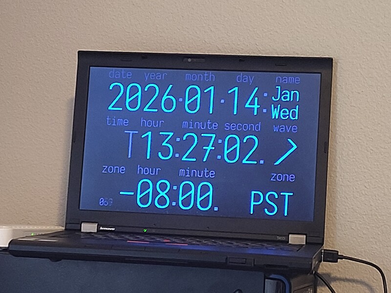

# [hyperclock](https://michael.malinov.com/hyperclock/v4/)

A fullscreen clock website.

Legacy version: [4:3 layout](https://michael.malinov.com/hyperclock/v2.html), [16:9 layout](https://michael.malinov.com/hyperclock/v2.html?nt)

## Structure
- `als-camera/`: ambient light sensor using the webcam, to dim the screen in low light
- `als-client/` and `als-host`: old als using an [arduino esplora](https://arduino.cc/esplora). kept for posterity
- `gentz/`: generate timezone abbreviations list (`tzabbr.js`)
- `v2.html`: legacy build (no configuration)
- `tzabbr.js`: shared timezone database info
- `v4/`: latest version webapp
